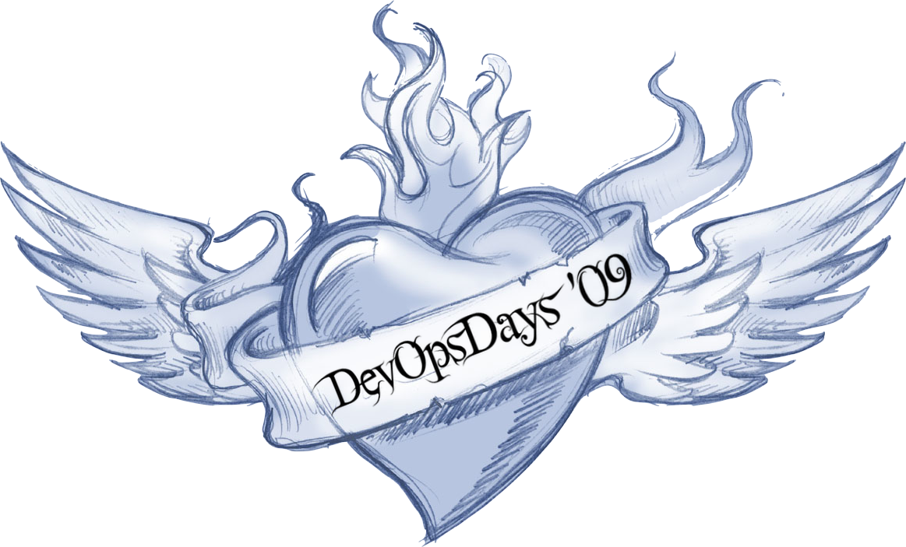

To understand what DevOps is you have to understand why how it started. What and why they changed the why they build software.

But the Importent thing first.

> DevOps is not a Team or a Title.<br>
> If you have a Devops Team you're doning it wrong.

Call Operaters know Devops-Engenier will change anything.

### What is the Definiton of Devops?

Before we go deep let's try to find a definition.

##### Let's ask google...

If you ask google What Devops mean you will find mostly the devops cycle.
The cycle shows the collaboration with Developers and Operater.


##### AWS

> DevOps is a Methodology that requires collaborations between teams involved in a product.

##### Microsoft DevOps Donovan Brown

> DevOps is the union of people, process, and products to enable continuous delivery of value to our end users.

##### Definition from Gene Kim on DevOps Summit in Las Vegas 2019

> The architecture, technical practices, and culture norms that enabls us to ...
> increase our ability to deliver applications and services ...
> quickly ans safely, which enables rapid experimentation and innovation, and the fastest delivery of value to our customers ...
> while ensuring world-class security, reliability, and stability ...
> so that we can win in the marketpalce

##### short definition from Jon Smart on the same conference

> Better Value Sooner Safer Happier

But how does all the definition help us to understand DevOps?
How Does it started?
There are diffrent meanings about the birthday of devops but the velocity conference on 22-24 june 2009 in Californication is on date with the Talk:

> 10 Deploys Per Day - Dev & Ops Cooperation at Flickr

5 Monst Later The DevOps Days happend



compare devops with fomel 1

compare devops with surgery in hospital

```csharp
using System.IO.Compression;

#pragma warning disable 414, 3021

namespace MyApplication
{
    [Obsolete("...")]
    class Program : IInterface
    {
        public static List<int> JustDoIt(int count)
        {
            Span<int> numbers = stackalloc int[length];
            Console.WriteLine($"Hello {Name}!");
            return new List<int>(new int[] { 1, 2, 3 })
        }
    }
}
```
